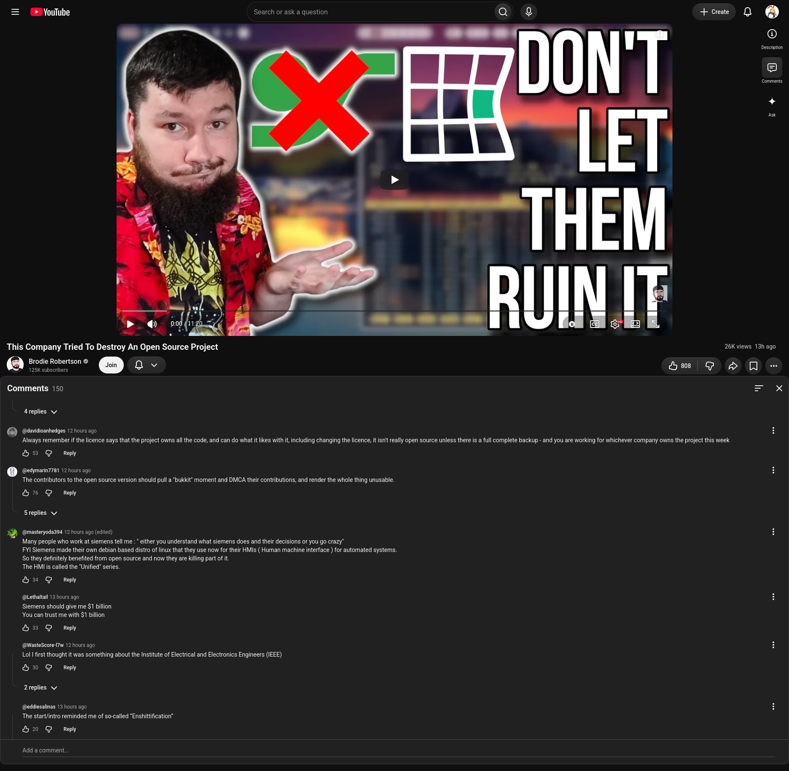

# unfuck-youtube-desktop
Various hacks from me trying to unfuck youtube's UI

A lot of stuff very much so WIP please help and make better if you can!

Structure:

* css: holds fixes for use with Stylus
* js: holds fixes for use with tampermonkey/violentmonkey
* ubo: holds fixes for use with Ublock Origin
* screenshots: holds screenshots of some of the changes (duh)

