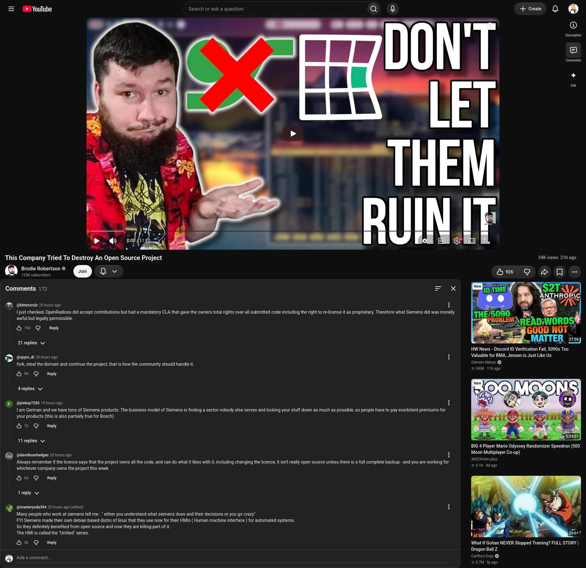

# unfuck-youtube-desktop
Various hacks from me trying to unfuck youtube's UI

A lot of stuff very much so WIP please help and make better if you can!

Structure:

* css: holds fixes for use with Stylus
* js: holds fixes for use with tampermonkey/violentmonkey
* ubo: holds fixes for use with Ublock Origin
* screenshots: holds screenshots of some of the changes (duh)

TODO:

 * make things more responsive (anyone with 4k screen that can help out would be appreciated!)
 * make a style that works for non-theater mode (theater mode is my preferred viewing method)
 * make theater mode video bigger
 * make video descriptions work better (right now it's a toggle between comments and video description and hte video description area is too big)